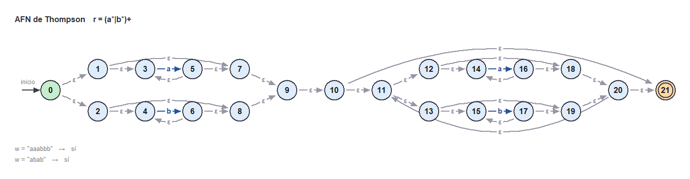
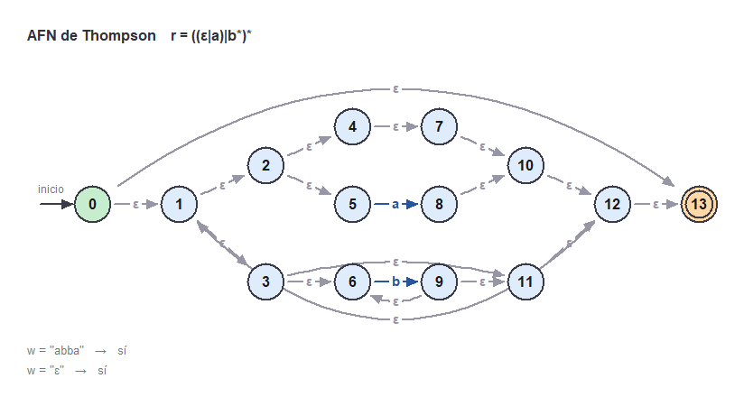
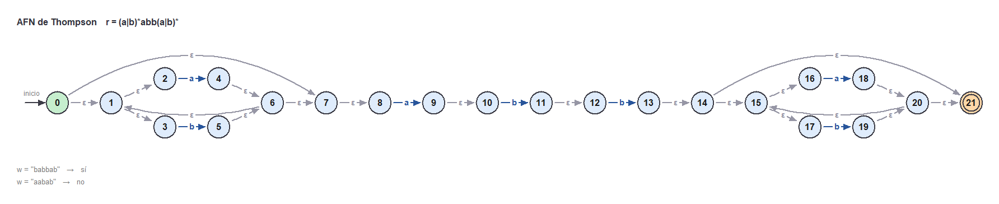
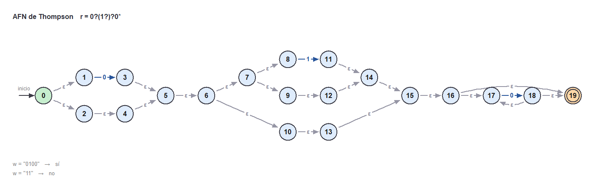

# Laboratorio 4 — Teoría de la Computación

## Problema 1: del árbol sintáctico al AFN con Thompson

El laboratorio pasado convertía una expresión regular a postfix con Shunting Yard y con eso
armaba el **árbol sintáctico**. Este reutiliza todo eso y sigue dos pasos más: le aplica el
**algoritmo de Thompson** al árbol para construir un **AFN**, lo dibuja en pantalla, y después
**simula** el autómata con una cadena `w` para decir si `w ∈ L(r)`.

Hecho en Elixir. El dibujo usa `:wx`, la librería gráfica que ya viene incluida con
Erlang/OTP, así que no hay que instalar nada aparte.

---

## Cómo correrlo

```bash
elixir afn_thompson.exs
```

Procesa las expresiones de `expresiones.txt`. Por cada una imprime todo el proceso en la
consola y abre una ventana con el AFN. Hay que cerrar la ventana para que siga con la
siguiente expresión.

Opciones:

```
--cadena w      prueba todas las expresiones con esa cadena
--linea N       corre solo la expresión N
--png           guarda las imágenes en imagenes/ en vez de abrir ventanas
--sin-ventana   solo imprime en la consola
```

### El archivo de entrada

Cada línea trae la expresión regular y, después de un `;`, las cadenas con las que se va a
probar, separadas por comas:

```
(a|b)*abb(a|b)* ; babbab, aabab
```

Si una línea no trae cadenas y tampoco se usó `--cadena`, el programa las pregunta. La cadena
vacía se escribe `ε` o se deja en blanco.

---

## Qué hace con cada expresión

1. Parte el texto en tokens y escribe la concatenación, que en regex es invisible (`abb` es en
   realidad `a·b·b`).
2. Convierte a postfix con Shunting Yard.
3. Arma el árbol sintáctico y le quita las extensiones `+` y `?`, porque Thompson solo sabe de
   `|`, `·` y `*`:

   ```
   X+   ->   X · X*      una vez obligatoria y después cero o más veces
   X?   ->   X | ε       o está X, o está la cadena vacía
   ```

4. Aplica Thompson: cada nodo del árbol se cambia por un pedacito de autómata con **una sola
   entrada y una sola salida**, y esos pedacitos se pegan con transiciones `ε` hasta llegar a
   la raíz.

   ```
   símbolo a          ──>(i)──a──>(f)

   concatenación      ──>[ izquierda ]──ε──>[ derecha ]──>

                            ε──>[ izquierda ]──ε
   unión              ──>(i)                      (f)──>
                            ε──>[  derecha  ]──ε

                           ┌───────── ε ─────────┐
   estrella           ──>(i)──ε──>[ hijo ]──ε──>(f)
                                └──── ε ────┘
   ```

   Un nodo `ε` del árbol es simplemente una transición que no consume nada, así que no necesita
   trato especial.

5. Simula el AFN con cada cadena `w` y responde **sí** o **no**.
6. Dibuja el autómata.

### La simulación

No se convierte a AFD. Se lleva el **conjunto de estados** en los que el autómata podría estar
al mismo tiempo:

- se arranca con la **ε-clausura** del estado inicial, o sea todo lo que se alcanza sin
  consumir nada;
- por cada símbolo de `w` se ve a dónde llega ese conjunto con ese símbolo, y al resultado se
  le vuelve a sacar la ε-clausura;
- al terminar la cadena, si el estado de aceptación quedó dentro del conjunto, entonces
  `w ∈ L(r)` y la respuesta es **sí**.

Los ciclos del `*` no dan vueltas infinitas porque la ε-clausura no vuelve a visitar un estado
que ya revisó.

### El dibujo

Thompson ya sabe qué forma tiene el autómata, así que él mismo va diciendo en qué fila y
columna va cada estado: los fragmentos de una concatenación se ponen uno detrás del otro y las
dos ramas de una unión, una arriba y otra abajo. El dibujo solo pasa eso a pixeles.

- El estado inicial va en verde y con la flechita de "inicio", el de aceptación en naranja y
  con doble círculo.
- Las transiciones con símbolo van en azul y las `ε` en gris.
- Las flechas que se regresan (las del `*`) se van por debajo y los saltos largos por encima,
  para no pasarles por encima a los estados.
- Los estados se numeran de izquierda a derecha para que el dibujo y la tabla de transiciones
  se lean igual.

---

## Resultados

**(a) `(a*|b*)+`** — postfix `a*b*|+`, y ya sin `+`: `a*b*|a*b*|*·` → 22 estados, 33 transiciones

| w          | ¿w ∈ L(r)? |
| ---------- | ---------- |
| `"aaabbb"` | sí         |
| `"abab"`   | sí         |



**(b) `((ε|a)|b*)*`** — postfix `εa|b*|*` → 14 estados, 19 transiciones

| w        | ¿w ∈ L(r)? |
| -------- | ---------- |
| `"abba"` | sí         |
| `ε`      | sí         |



**(c) `(a|b)*abb(a|b)*`** — postfix `ab|*a·b·b·ab|*·` → 22 estados, 27 transiciones

| w          | ¿w ∈ L(r)? |                       |
| ---------- | ---------- | --------------------- |
| `"babbab"` | sí         | tiene `abb` adentro   |
| `"aabab"`  | no         | nunca aparece `abb`   |



**(d) `0?(1?)?0*`** — postfix `0?1??·0*·`, y ya sin `?`: `0ε|1ε|ε|·0*·` → 20 estados, 24 transiciones

| w        | ¿w ∈ L(r)? |                          |
| -------- | ---------- | ------------------------ |
| `"0100"` | sí         | `0`, `1` y dos ceros más |
| `"11"`   | no         | el `1?` solo permite uno |



---

## Archivos

- `afn_thompson.exs` — programa principal, junta todas las etapas
- `lexer.exs` — parte el texto en tokens
- `shunting_yard.exs` — inserta el `·` y convierte de infix a postfix
- `arbol.exs` — los nodos del árbol y todo lo que se le hace
- `thompson.exs` — el AFN y la construcción de Thompson
- `simulacion.exs` — la ε-clausura y la simulación de la cadena
- `ventana.exs` — el dibujo
- `expresiones.txt` — las expresiones del enunciado con sus cadenas
- `imagenes/` — los AFN generados con `--png`

---

## Video

_(pendiente)_
