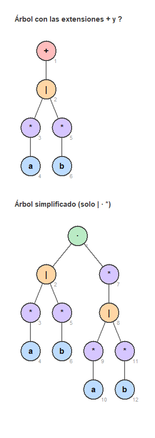
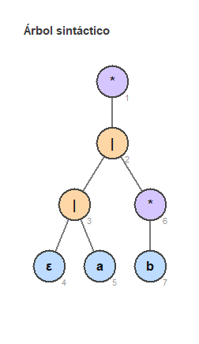
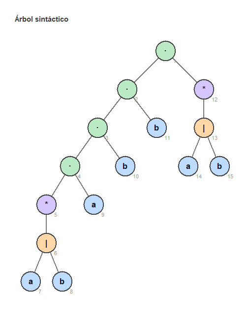
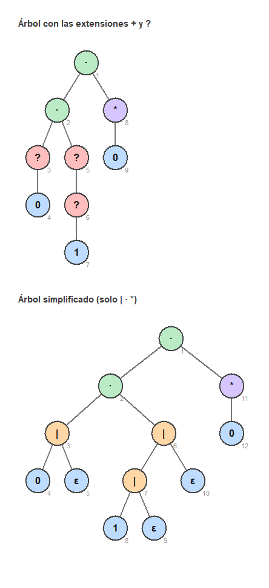

# Laboratorio 3 — Teoría de la Computación

## Problema 1: del postfix al árbol sintáctico

El laboratorio pasado convertía una expresión regular de infix a postfix con Shunting Yard.
Este reutiliza ese código y sigue un paso más: con el postfix arma el **árbol sintáctico** de
la expresión, le quita las extensiones `+` y `?`, y lo dibuja en pantalla.

Hecho en Elixir. El dibujo usa `:wx`, la librería gráfica que ya viene incluida con
Erlang/OTP, así que no hay que instalar nada aparte.

---

## Cómo correrlo

```bash
elixir arbol_sintactico.exs
```

Procesa las cuatro expresiones de `expresiones.txt`. Por cada una imprime todo el proceso en
la consola y abre una ventana con el árbol. Hay que cerrar la ventana para que siga con la
siguiente expresión.

Opciones:

```
--linea N       corre solo la expresión N
--png           guarda las imágenes en imagenes/ en vez de abrir ventanas
--sin-ventana   solo imprime en la consola
```

---

## Qué hace con cada expresión

1. Parte el texto en tokens.
2. Escribe la concatenación, que en regex es invisible (`abb` es en realidad `a·b·b`).
3. Convierte a postfix con Shunting Yard, mostrando la tabla paso por paso.
4. Arma el árbol leyendo el postfix de izquierda a derecha con una pila de nodos.
5. Quita las extensiones `+` y `?`.
6. Dibuja el árbol.

### Los nodos

Cada tipo de nodo es un struct distinto — símbolo, unión, concatenación, estrella, más y
opcional — así el tipo del objeto ya dice qué operación representa. Las hojas guardan su
símbolo, los operadores de un operando guardan un hijo, y los de dos guardan izquierda y
derecha. Al final cada nodo recibe un número, que es el que sale en gris en el dibujo.

### La simplificación de `+` y `?`

```
X+   ->   X · X*      una vez obligatoria y después cero o más veces
X?   ->   X | ε       o está X, o está la cadena vacía
```

Se hace sobre el árbol ya construido y no sobre el texto, porque así el operando `X` ya es
directamente el subárbol hijo y no hay que buscar dónde empieza ni dónde termina.

Para el `+` el subárbol se duplica, por eso el árbol de `(a*|b*)+` pasa de 6 nodos a 12.

### El dibujo

Las hojas se acomodan una tras otra de izquierda a derecha y cada padre queda centrado
encima de sus hijos. El color del círculo depende del tipo de nodo: azul los símbolos, verde
la concatenación, naranja la unión, morado la estrella, y rojo el `+` y el `?`.

Cuando la expresión usa `+` o `?`, la ventana muestra los dos árboles: el original arriba y
el simplificado abajo.

---

## Resultados

**(a) `(a*|b*)+`**

```
postfix                a*b*|+
postfix simplificado   a*b*|a*b*|*·
```



**(b) `((ε|a)|b*)*`** — no usa `+` ni `?`, el árbol ya estaba simplificado

```
postfix                εa|b*|*
```



**(c) `(a|b)*abb(a|b)*`** — no usa `+` ni `?`, el árbol ya estaba simplificado

```
postfix                ab|*a·b·b·ab|*·
```



**(d) `0?(1?)?0*`**

```
postfix                0?1??·0*·
postfix simplificado   0ε|1ε|ε|·0*·
```



---

## Archivos

- `arbol_sintactico.exs` — programa principal, junta todas las etapas
- `lexer.exs` — parte el texto en tokens
- `shunting_yard.exs` — inserta el `·` y convierte de infix a postfix
- `arbol.exs` — los objetos de cada nodo y todo lo que se le hace al árbol
- `ventana.exs` — el dibujo
- `expresiones.txt` — las cuatro expresiones del enunciado
- `imagenes/` — los árboles generados con `--png`

---

## Video

<!-- Pegar aquí el enlace de YouTube (video no listado) -->
_Pendiente: subir el video y pegar el enlace._
